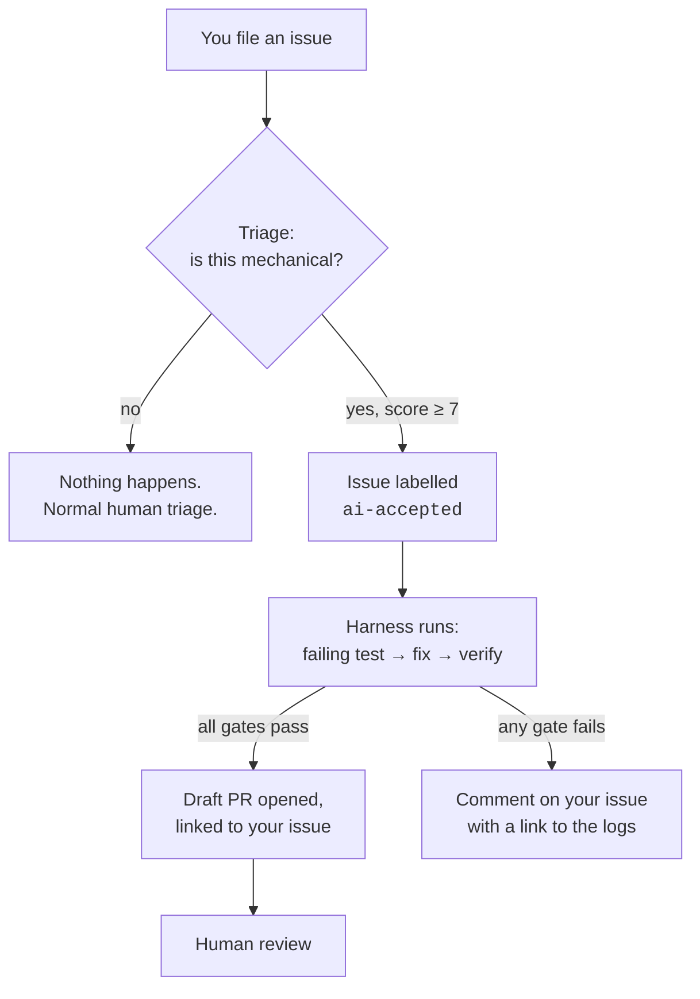
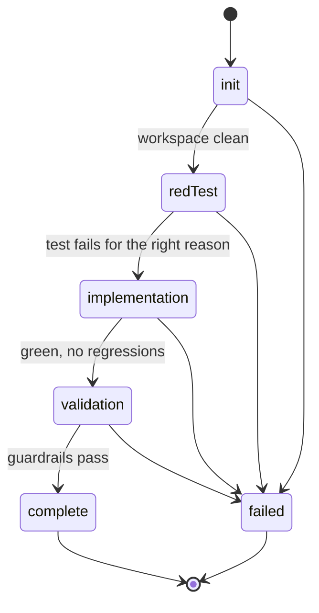

# Autonomous Issue Resolution for `in_app_purchase_storekit`

This package has an automated pipeline that can take certain GitHub issues and
open a Draft PR that fixes them, with no human in the loop until review.

This document describes that pipeline **from the outside in** — what you should
expect as someone filing an issue, and what you are actually looking at when an
agent-authored PR shows up.

> [!NOTE]
> "Autonomous" here means unattended, not trusted. Every PR the pipeline
> produces is a **draft** and requires the same review as any human
> contribution. See [What the PR does and does not guarantee](#what-the-pr-does-and-does-not-guarantee).

---

## The short version



Two separate GitHub Actions workflows do this. They are deliberately decoupled:
triage decides *whether* to try, resolution decides *what* to change.

| Stage | Workflow | Trigger |
|---|---|---|
| Triage | [`triage.yml`](../../../../.github/workflows/triage.yml) | Issue opened or labelled |
| Resolution | [`agent_resolve.yml`](../../../../.github/workflows/agent_resolve.yml) | Issue gains `ai-accepted` |

---

## Stage 1: Triage — will the bot even try?

Most issues are never touched by this pipeline. Triage only considers an issue
if it looks StoreKit-related: it carries `p: in_app_purchase`, `team-ios`, or
`storekit-triage`, or its title mentions `storekit` / `StoreKit` /
`in_app_purchase_storekit`.

Issues that clear that bar go through two tiers.

### Tier 1 — free keyword gate

A pure-Dart keyword filter drops the issue immediately, with no model call, if
the title or body mentions any of:

```
flaky · intermittent · race condition · testflight · sandbox receipt · memory leak
```

These are things an offline harness fundamentally cannot verify — it has no
device, no Apple sandbox account, and no way to reproduce a timing-dependent
bug. Rejecting them for free keeps cost proportional to the issues actually
worth evaluating.

### Tier 2 — model judgement

Surviving issues go to a single Gemini call that returns a structured verdict:

| Field | Meaning |
|---|---|
| `is_mechanical` | Is this a well-defined, local change? |
| `suitability_score` | 0–10 confidence that it can be resolved unattended |
| `category` | e.g. `missing_field`, `mapping_error`, `flaky`, `architectural` |
| `target_files_hint` | Files the fix will likely touch |
| `reasoning` | Short justification, posted back to you |

**The issue is accepted only if `is_mechanical` is true *and* the score is 7 or
above.** On acceptance the bot applies the `ai-accepted` label and comments on
your issue with the score, category, and reasoning — so you always know why it
engaged.

If the issue is rejected, **nothing is posted and nothing is labelled.** Silence
from the bot is not a judgement on your issue's validity; it just means the
issue goes through normal human triage.

### What a good candidate looks like

The sweet spot is a small, verifiable gap between Apple's StoreKit 2 API and
what this package exposes to Dart.

| Issue | Verdict |
|---|---|
| "Expose `originalPurchaseDate` from StoreKit 2 `Transaction` to Dart" | ✅ score 10, `missing_field` |
| "Crash when mapping StoreKit `Transaction` if `productId` is null" | ✅ score 8, `mapping_error` |
| "Purchases intermittently time out on spotty cellular" | ❌ score 2, `flaky` |
| "Need family sharing verification in live TestFlight" | ❌ score 1, `architectural` |

> [!TIP]
> If you want an issue to be a good candidate, name the concrete symbol you
> expect to exist and where it should surface — "`SK2Transaction` should expose
> `reason`" is far more actionable than "transaction info is incomplete."

---

## Stage 2: Resolution — how the fix gets built

Once `ai-accepted` is applied, the resolution workflow starts. It runs the
harness, which is a small state machine. Each phase has a **gate**, and failing
a gate ends the run — the pipeline never proceeds on a "probably fine."



### `init`
Reads the issue title and body, resets the workspace to a clean baseline, and
snapshots the target test file so it can be restored later.

### `redTest` — prove the bug exists
The agent writes a unit test that demonstrates the problem, then runs it.

**Gate: the test must fail, and fail for the right reason.** A test that passes
immediately proves nothing (the bug isn't reproduced, or the test doesn't
actually assert anything). The harness also specifically rejects tests that fail
because the model invented an API that never existed — a hallucinated helper
produces a failure that looks correct but would be "fixed" by writing the wrong
code.

This is the step that makes the whole pipeline trustworthy: a fix is only
meaningful relative to a test that was *observed* failing beforehand.

### `implementation` — make it pass
The agent edits source, then runs code generation (Pigeon, and `build_runner`
where relevant). Five gates, all required, in this order:

1. The **Swift sources type-check**.
2. The new test passes.
3. The **full package suite** passes — no regressions.
4. `dart analyze` is clean.
5. Formatting is clean.

The Swift gate runs first because it is the cheapest and catches the failure the
Dart tests structurally cannot. The Dart tests mock the platform channel, so a
Swift translator that references a StoreKit property that does not exist will
still let every Dart test pass. The harness therefore type-checks the native
sources directly (`swiftc -typecheck` against the macOS SDK and the Flutter
framework — no Xcode project, no CocoaPods, roughly a second) so an invented
Apple API is rejected in the loop rather than discovered by a reviewer.

> [!NOTE]
> If the Swift toolchain or the Flutter engine artifacts aren't available, the
> check is **skipped, not failed** — so the pipeline still works on a machine
> without Xcode. When that happens the PR body says so explicitly rather than
> staying silent about it.

If any gate fails, the harness **reverts the workspace to its pre-attempt state**
and retries, feeding the failure back to the model so the next attempt is
informed rather than a blind re-roll. Up to 5 attempts by default, but the
harness **stops early if two consecutive attempts fail the same way** — a model
repeating itself will keep repeating itself, and further identical rolls only
cost time and quota. A failed run leaves no partial edits behind.

### `validation` — guardrails
A final check on the actual diff, independent of anything the model claims:

| Guardrail | Rule |
|---|---|
| Forbidden files | `pubspec.yaml` and `CHANGELOG.md` must be untouched |
| Generated output | Files matching `.g.` must come from the generator, not the agent |
| Package boundary | Changes must stay inside `in_app_purchase_storekit` |
| Tooling exclusion | The agent's own `.agents/` files never enter the PR |

The generated-output rule is checked against the agent's *proposed patches*
rather than the final diff, and before code generation runs. Pigeon rewrites
`.g.dart` and `.g.swift` on every successful run, so a diff-level check would
reject everything; and checking after codegen would let a hand-edit be silently
overwritten, hiding the fact that it happened at all.

Version bumps and changelog entries are deliberately left to humans, since they
encode release intent the agent has no basis to decide.

---

## Stage 3: What you receive

On success you get a **Draft PR** on branch `agent/fix-issue-<n>`, titled
`[in_app_purchase_storekit] … (fixes #<n>)`. The body contains:

- A short description of the change and the list of modified files.
- A one-line statement that the harness verified the reproduction test failed
  first and then passed, with the full suite green, analysis clean, and
  formatting clean, plus a pointer back to this document.
- A collapsed **"Verified failure before the fix"** section containing the
  *actual output* of the reproduction test when it ran against unmodified code.
- If the native type-check could not run, a **`Native sources were not
  type-checked`** warning naming the reason. Its absence means the Swift
  sources did compile.

On failure you get a comment on the issue with a link to the run, and the label
stays on. Nothing is pushed.

### What the PR does and does not guarantee

The gates listed in Stage 2 were **actually executed and observed** on the
runner — they are recorded outcomes, not the model's self-report — and the PR
could not have been opened if any one of them had failed. That is a real
guarantee, and a stronger one than most drafts arrive with.

The failure output is embedded so you don't have to take that on faith. Read it
first: it tells you whether the test failed for the *right* reason. A test that
failed with a missing-symbol error on the API the issue is about is strong
evidence. A test that failed on an assertion against an API that already worked
may just be a wrong expectation that the fix then bent the code to satisfy.

What it does **not** tell you:

> [!WARNING]
> **The Draft PR currently arrives with no CI status checks.** GitHub
> deliberately does not trigger workflows for PRs created with the default
> `GITHUB_TOKEN`, to prevent workflows from recursively spawning more
> workflows. The PR will show an empty check list, which reads as "nothing
> failed" but actually means "nothing ran."
>
> Until the pipeline is switched to a PAT or GitHub App token, **treat every
> agent PR as unvalidated by CI** and run the package tests locally before
> trusting it. The harness's own verification did run — but it ran on the
> runner, not as a reviewable check on the PR.

Other limits worth holding in mind:

- **Native code is type-checked, not run.** The Swift sources compile, so the
  APIs they reference exist — but no native `XCTest` suite runs, so nothing
  verifies they *behave* correctly. The check also targets macOS, which means
  `#if os(iOS)` branches and iOS-only availability are still unchecked.
- **Passing tests are not correct behaviour.** The agent wrote both the test and
  the fix. A test can be green and still encode the wrong expectation — review
  the assertion, not just the diff.
- **No API design judgement.** It will happily expose a field in a way that is
  locally consistent and globally wrong for the package's conventions.

---

## Reviewing an agent PR

1. **Read the test first, not the fix.** It is the specification the fix was
   written against. If the assertion is wrong, everything downstream is wrong.
2. **Confirm the failure was real.** The PR body asserts FAIL_TO_PASS; the run
   logs show the actual failure output if you want to verify it.
3. **Check generated code is consistent.** Pigeon output should match the
   `pigeons/sk2_pigeon.dart` change — a hand-edited `.g.dart` is a red flag.
4. **Run it locally**, since CI did not:
   ```bash
   cd packages/in_app_purchase/in_app_purchase_storekit
   flutter test
   dart analyze
   ```
5. **Add the changelog and version bump yourself.** The guardrails guarantee
   the agent did not.

---

## Operating the pipeline

### Triggering a run manually

Both workflows support `workflow_dispatch`, so you can run either against an
arbitrary issue number from the Actions tab.

The resolution workflow takes a **`dry_run`** input, which walks the full
pipeline but stops short of publishing. Use it to rehearse against a real issue
without creating a PR.

> [!NOTE]
> `workflow_dispatch` only appears in the UI for workflows present on the
> default branch, and `issues: [labeled]` likewise only ever executes the
> default branch's copy. A change to either workflow has no effect until it
> lands on the default branch.

### Getting the logs

The harness writes prompts, raw model responses, and per-attempt failure traces
to `.agents/logs/`. That directory is gitignored and dies with the runner, so
the workflow uploads it as an artifact named `agent-logs-issue-<n>`, retained
for 14 days. It is uploaded with `if: always()`, because the failure case is
exactly when you need it.

Per-attempt artifacts are the fastest way to understand a bad run — for example
`red_test_attempt_2_hallucinated_fromMap.txt` tells you the model invented an
API, which is a very different problem from a genuine test failure.

### Safety properties

| Property | Why |
|---|---|
| Runs are serialized per issue | Two runs cannot race on the same branch |
| 45-minute timeout | A stuck retry loop cannot burn the CI budget |
| Credentials checked upfront | Fails in seconds, not after a full SDK setup |
| Re-runs reuse the existing PR | Re-running an issue updates the PR instead of erroring |
| Push uses `--force-with-lease` | Replaces the agent's own prior attempt, refuses if anyone else pushed |

---

## Running the harness locally

```bash
cd packages/in_app_purchase/in_app_purchase_storekit

# Rehearse without touching GitHub.
dart .agents/tool/run.dart --issue=<n> --dry-run

# Full run, opening a Draft PR.
dart .agents/tool/run.dart --issue=<n> --repo=<owner>/packages --publish-pr
```

Requires `GEMINI_API_KEY` (or GCP Workload Identity credentials) and an
authenticated `gh` CLI. Model selection lives in `.agents/config.json`
(gitignored), which sets a primary model and an ordered fallback list; sensible
defaults apply when the file is absent, so CI works without it.

> [!IMPORTANT]
> Publishing checks out a generated `agent/fix-issue-<n>` branch. The harness
> restores your original branch afterwards — but if publishing fails before
> committing, it will deliberately leave you on the agent branch rather than
> force a checkout that would discard uncommitted work. It says so in the log
> when this happens.

### What a local run leaves behind

| Outcome | State of your working tree afterwards |
|---|---|
| Run failed | Clean. The harness reverts its own edits. |
| Succeeded with `--publish-pr` | Clean. The fix is committed on `agent/fix-issue-<n>`. |
| Succeeded without `--publish-pr` | **The fix is left uncommitted**, so you can inspect it. |

That third row is the intended behaviour, not a leak — inspecting the diff is
the reason to run without `--publish-pr`. But it does mean the generated fix and
any work of your own are sitting in the same dirty tree.

> [!CAUTION]
> **Commit your own work before a local run.** `git stash` is repo-wide: it
> cannot tell the harness's generated fix apart from your in-progress edits to
> the harness source, and will sweep up both. Discard a generated fix with a
> scoped `git checkout -- <paths>` instead of a blanket stash.

---

## Where the code lives

| File | Role |
|---|---|
| [`run.dart`](tool/run.dart) | CLI entrypoint; wires triage → harness → exit code |
| [`harness.dart`](tool/harness.dart) | The phase state machine and its gates |
| [`harness_context.dart`](tool/harness_context.dart) | Run config, mutable state, and log/artifact recording |
| [`triage.dart`](tool/triage.dart) | Two-tier issue evaluation |
| [`gemini_agent.dart`](tool/gemini_agent.dart) | Model calls, prompts, fallback chain |
| [`codegen.dart`](tool/codegen.dart) | Pigeon and `build_runner` invocation |
| [`native_analyzer.dart`](tool/native_analyzer.dart) | Swift type-checking of the darwin sources |
| [`test_runner.dart`](tool/test_runner.dart) | `flutter test` invocation and result capture |
| [`guardrails.dart`](tool/guardrails.dart) | Diff-level invariant checks |
| [`workspace.dart`](tool/workspace.dart) | Reverting the tree between attempts, excluding `.agents/` |
| [`publisher.dart`](tool/publisher.dart) | Branch, commit, push, and Draft PR creation |
| [`playbook.md`](playbook.md) | The domain procedure the agent follows for StoreKit work |

Each side-effecting concern is behind an interface with a default
implementation, so the harness can be driven end-to-end in tests with no
network, no git, and no model calls. The suite lives in `.agents/tool/test/`.
