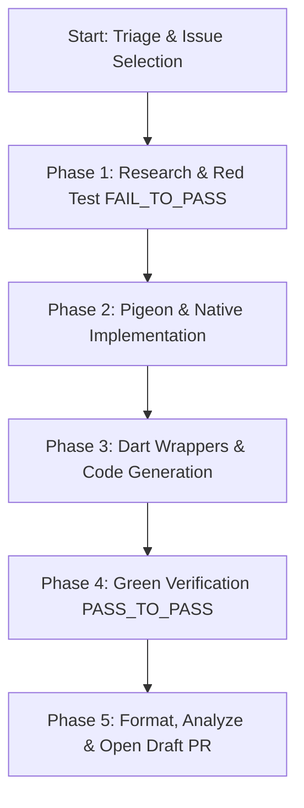

# Playbook: StoreKit 2 Mechanical Issue-to-PR Workflow

This playbook outlines the deterministic workflow for an agent to autonomously resolve StoreKit 2 mechanical issues (such as exposing missing Apple StoreKit properties, fixing type mismatches, or correcting Pigeon mappings) in `in_app_purchase_storekit`.



---

## Phase 1: Research & FAIL_TO_PASS Test

1. **API Research (Offline MCP)**:
   - Query the `local-apple-docs-dart` MCP server (`search_docs`, `read_doc_file`) to inspect the target Apple StoreKit 2 property or struct (e.g. `Product`, `Transaction`, `RenewalInfo`).
   - Verify exact types, nullability, and iOS/macOS availability.

2. **Write Failing Unit Test (`FAIL_TO_PASS`)**:
   - Write a unit test asserting the missing property or expected behavior on clean `main`.
   - **Target**: `test/in_app_purchase_storekit_2_platform_test.dart` (or `test/store_kit_wrappers/`).
   - Execute test:
     ```bash
     flutter test test/in_app_purchase_storekit_2_platform_test.dart
     ```
   - **Gate**: The test MUST fail (or fail to compile because the symbol is missing) before modifying any implementation code.

---

## Phase 2: Pigeon & Native Implementation

1. **Update Pigeon Definitions**:
   - Modify `pigeons/sk2_pigeon.dart` to add the new field or method to the appropriate `@ConfigurePigeon` interface or message class.
2. **Regenerate Pigeon Code**:
   ```bash
   dart run pigeon --input pigeons/sk2_pigeon.dart
   ```
   This updates:
   - `lib/src/sk2_pigeon.g.dart`
   - `darwin/in_app_purchase_storekit/Sources/in_app_purchase_storekit/StoreKit2/StoreKit2Messages.g.swift`
3. **Update Swift Translators & Plugins**:
   - In `darwin/in_app_purchase_storekit/Sources/in_app_purchase_storekit/StoreKit2/StoreKit2Translators.swift`, map the native StoreKit 2 property to the newly generated Pigeon message.
   - Add/update native unit tests in `example/shared/RunnerTests/StoreKit2TranslatorTests.swift`.

---

## Phase 3: Dart Wrappers & Serialization

1. **Update Public & Internal Wrappers**:
   - In `lib/src/store_kit_2_wrappers/`, update the corresponding wrapper class (e.g., `sk2_product_wrapper.dart` or `sk2_transaction_wrapper.dart`) to expose the property to Dart consumers.
2. **Serialization (If Applicable)**:
   - If `@JsonSerializable()` models were modified:
     ```bash
     dart run build_runner build -d
     ```

---

## Phase 4: PASS_TO_PASS Verification

1. **Verify New Test Passes**:
   - Re-run the test written in Phase 1:
     ```bash
     flutter test test/in_app_purchase_storekit_2_platform_test.dart
     ```
   - Ensure the assertion passes cleanly.
2. **Verify Full Package Suite (No Regressions)**:
   ```bash
   dart run $REPO_ROOT/script/tool/bin/flutter_plugin_tools.dart dart-test --packages in_app_purchase_storekit
   ```
   All existing tests must pass.

---

## Phase 5: Hygiene, Analysis & PR Creation

1. **Format All Modified Files**:
   ```bash
   dart run $REPO_ROOT/script/tool/bin/flutter_plugin_tools.dart format --packages in_app_purchase_storekit
   ```
2. **Static Analysis Check**:
   ```bash
   dart run $REPO_ROOT/script/tool/bin/flutter_plugin_tools.dart analyze --packages in_app_purchase_storekit
   ```
3. **Verify Guardrails**:
   - Check `git status --porcelain`.
   - **Invariant**: Confirm that neither `pubspec.yaml` nor `CHANGELOG.md` has been modified.
4. **Open Draft PR**:
   - Create a clean git commit and push branch to the fork.
   - Open a Draft PR following `.github/PULL_REQUEST_TEMPLATE.md` with:
     - Title prefix: `[in_app_purchase_storekit]`
     - Link to the fixed issue.
     - Summary of `FAIL_TO_PASS` test and generated Pigeon diffs.
