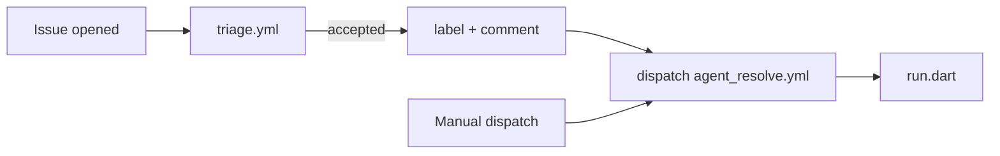
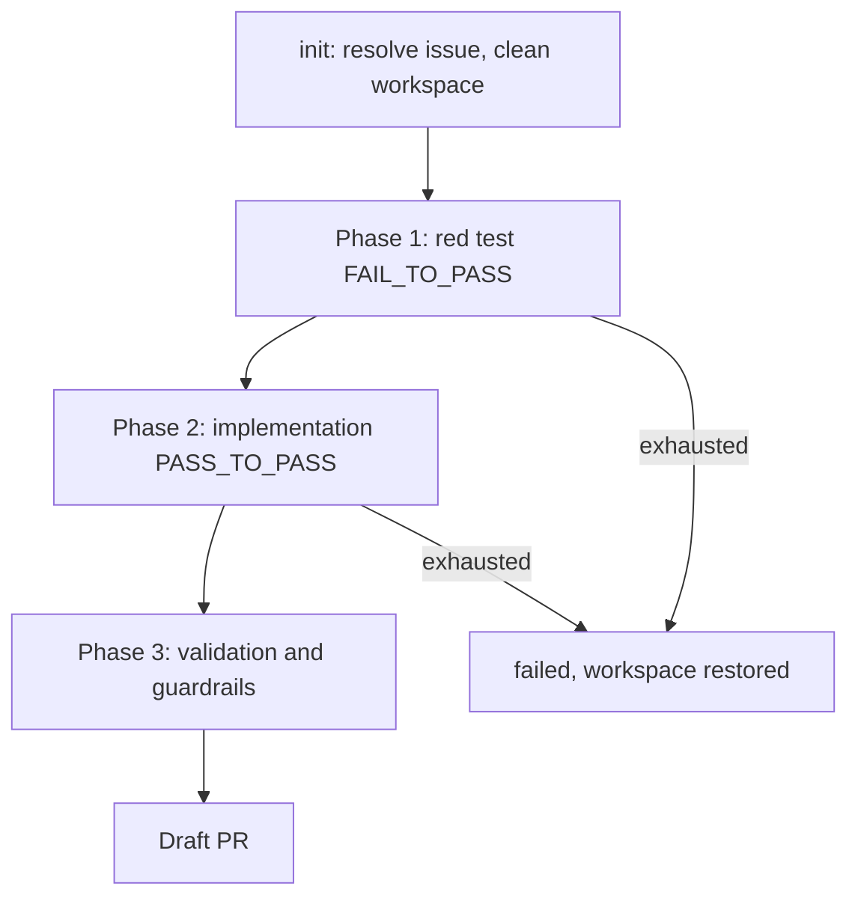

# The `in_app_purchase_storekit` Agent Harness

How the harness works and, more importantly, why it is built this way. Design
rationale lives here rather than scattered across code comments; the code
comments cover local detail, this covers intent.

---

## What this is

A deterministic program that takes a GitHub issue and produces a verified Draft
PR, using a language model only for the parts that genuinely require judgement.

The model writes code. Everything else — deciding whether the work is worth
doing, whether the change is correct, whether it broke anything, whether it is
even allowed — is ordinary Dart running ordinary tools. The model is a
component inside the system, not the system.

This distinction is the whole design. A model asked to "fix this issue and
check your work" will report success it has not earned. A model asked to
produce a patch, which is then judged by a test suite it cannot edit, either
passes or does not.

---

## Scope and constraints

| Constraint | Why |
|---|---|
| **iOS/macOS only** | The maintainer is on the Flutter iOS team. Swift-specific tooling is first-class, not a special case. Android is explicitly out of scope. |
| **`in_app_purchase_storekit` only** | Package-agnostic generality was tried and produced bloat. Hardcoding one package keeps the harness small enough to reason about. Generalisation comes later, from evidence. |
| **No new dependencies** | Flutter iOS is moving away from CocoaPods and the maintainer does not want to add to the dependency surface. |
| **`dart:` imports only** | CI runs `dart run.dart` with no `pub get`. Every library reachable from `run.dart` — including `gemini_agent.dart` and `symbol_oracle.dart` — must use only `dart:` libraries and relative imports. Even `package:meta` resolves during analysis but fails at run time. |
| **Never touch `pubspec.yaml` or `CHANGELOG.md`** | Release metadata is a human decision. |

---

## How a run starts

Two entry points, both ending in the same pipeline.



`triage.yml` fires on `issues: [opened]`, runs triage alone, and on acceptance
labels the issue and dispatches the resolve workflow. This needs
`actions: write` but no PAT: the usual rule that `GITHUB_TOKEN` cannot trigger
further workflows has an explicit exemption for `workflow_dispatch`.

Triage is separated from resolution because the cost profile differs by orders
of magnitude. Triage runs on *every* incoming issue and is one structured
classification call on a cheap model, typically about a second. Resolution runs
only on accepted issues and can take twenty minutes. Hence triage keeps its own
cheap default model instead of inheriting the harness's.

---

## Triage: two tiers

**Tier 1** is a static keyword gate — no API call. Rejects issues that are
plainly not mechanical work.

**Tier 2** asks Gemini for a structured verdict against a response schema:
category, whether the work is mechanical, a suitability score, and a target
files hint. Acceptance requires clearing a minimum score.

One distinction matters more than it looks: **an infrastructure failure is not
a rejection.** If triage cannot complete — API down, quota exhausted — the
pipeline exits non-zero, says plainly that the issue has *not* been assessed,
and leaves the label alone so it can be retried. A rejection exits zero. Green
must mean "assessed and declined", never "we never looked".

---

## The run loop



### Phase 1 — the red test must fail

The model writes a test reproducing the issue, and the harness **requires it to
fail** on clean `main`. A test that passes before the fix proves nothing; it is
the single most common way an agent fakes success.

Each attempt resets the test file to its original content first, so attempts
cannot accumulate.

The verified failure output is kept. It is the evidence the bug was real, and
the only way a reviewer can confirm the test failed *for the right reason*
rather than by coincidence.

### Phase 2 — implementation, gated in a deliberate order

Each attempt runs five gates. The order is chosen so the cheapest and most
specific failure surfaces first, and so each gate's feedback is actionable:

1. **Code generation** (Pigeon). Must succeed before anything downstream is
   meaningful.
2. **Native type-check** (Swift). Runs *after* codegen because codegen rewrites
   the generated Swift bindings, and *before* the Dart tests because the Dart
   tests mock the platform channel — they will happily pass while the Swift is
   nonsense.
3. **Target test must now pass** (`PASS_TO_PASS`).
4. **Full package suite** — no regressions.
5. **Static analysis and guardrails.**

Gate 2 is the one that earns its place. Without it the harness could produce a
green Dart run over Swift that does not compile.

### Phase 3 — validation

A final guardrail and hygiene pass over the resulting diff before publishing.

---

## Integrity rules

These exist because each one has been violated in practice.

| Rule | Why |
|---|---|
| **The red test is re-pinned before every judged run** | Nothing prevents the model from patching the test file. A fix that weakens its own test would otherwise clear every downstream gate. Restoring the verified test makes the judge immune to the thing being judged. |
| **The workspace reverts to committed state before each attempt** | One attempt's half-finished edits must never become the next attempt's starting point. Untracked files present at the start are the developer's and survive; anything the agent creates does not. |
| **Generated files may not be hand-edited** | `*.g.dart` and `*.g.swift` come from the generator. Checked on the *proposed patches* rather than the final diff, because codegen legitimately rewrites them moments later. |
| **Changes stay inside the package** | A fix that edits unrelated packages is out of scope by definition. |
| **On failure, leave nothing behind** | A failed run restores the working tree, including removing the red test. |
| **Every prompt and response is recorded as a CI artifact** | This is how the harness is debugged. See "How to diagnose a failure" below. |

---

## Retry and failover

Up to five implementation attempts, each fully isolated.

**Early abort on repetition.** If two consecutive attempts fail the same way —
compared after normalising digits out of the message — the harness stops.
Another attempt costs a model call plus a full suite run, and an unchanged
failure is strong evidence the model is resampling the same misconception
rather than exploring.

**Model failover** walks a chain of Flash models. It advances only on 503, 429
and 404; any other error breaks immediately, because retrying a malformed
request just burns quota. Note 503 means *busy* and 429 means *quota* — in
practice only Pro ever returned 429, which is why Pro is no longer in the
chain.

---

## What the model is told

The quality of the patch is mostly a function of the context, not the prompt
wording. Three things are assembled:

**1. The right files.** Six are injected, including the Pigeon IDL, the
translators, the test fakes — and, critically, the **conformance site**: the
Swift extension declaring `extension InAppPurchasePlugin: InAppPurchase2API`.
Adding a method to the IDL breaks the build *there*, in the one file that does
not look like "the file about this feature". Every Pigeon plugin has such a
site, and this generalises: inject it.

**2. The two shapes of change.** Either a new field on an existing message, or a
new host method plus message classes with a mandatory native implementation.
Naming the two shapes gives the model a template rather than a blank page.

**3. Authoritative SDK symbols** — see below.

### How we learned what to inject

**The agent's failures name the context it lacks.** It invented a filename,
`InAppPurchase2ApiImpl.swift`, which told us exactly which real file was
missing from its context. This is the repeatable onboarding procedure for any
new package: run it, read what it reached for, give it that.

---

## The SDK symbol oracle

A model cannot know Apple's exact symbol names, and no amount of repository
context supplies them — they are in the SDK, not the repo. Left to itself the
model produced `RenewalState.inPadd` and `RenewalState.inBillingRetry`; the real
case is `inBillingRetryPeriod`.

So the harness extracts them from the SDK on the machine running the build,
using `swift-symbolgraph-extract`, which ships with Xcode. Nothing is scraped
and nothing is vendored — the graph is generated from that machine's own
licensed SDK into a temporary directory, and cached.

**Everything about it fails soft.** No Xcode, no SDK, a malformed graph: the
result is an empty context block, never an exception. The agent carries on
exactly as it did before the oracle existed.

### Why selection is subtle

An issue names a few broad types; those types transitively match hundreds of
symbols; the prompt can hold a hundred or so. Which ones?

Three relevance tiers: symbols named outright, members of a named type, and
members of a type *nested inside* a named type. The third tier is what makes it
work — an issue rarely names the enum whose cases the agent will need. Issue #7
said `Product.SubscriptionInfo` and never `RenewalState`.

Then the budget is handed out **round-robin across parent types, smallest type
first**, rather than as a prefix cut. Two measured failures forced this:

- A prefix cut let `Product` and `SubscriptionInfo` consume over half of 208
  matches; the needed case sat at index 172.
- A per-type cap alone still spent the budget in path order, so `PurchaseError`
  and `ProductType` exhausted it before the alphabetically later
  `RenewalState`.

Within a type, case-like members rank ahead of methods, because **a partial
case list is worse than none — it looks complete.** Note that testing for
"enum case" is insufficient: `RenewalState` is a `RawRepresentable` struct and
its cases are static properties.

Conformance boilerplate (`==`, `hashValue`, `RawValue`, protocol plumbing) is
filtered out, since it otherwise crowds out real API.

---

## Seams

Seven ports, each with one production implementation and fakes in tests. The
point is testability without network or Xcode, not speculative pluggability.

| Port | Default |
|---|---|
| `TestRunner` | `FlutterTestRunner` |
| `CodeGenerator` | `DefaultCodeGenerator` |
| `GuardrailValidator` | `DefaultGuardrailValidator` |
| `NativeAnalyzer` | `SwiftTypecheckAnalyzer` |
| `Workspace` | `GitWorkspace` |
| `HarnessAgent` | `GeminiHarnessAgent` |
| `PrPublisher` | `GitHubPrPublisher` |

`SymbolOracle` is deliberately *not* a port — it is an injectable field on the
agent. Adding an interface for a single implementation would be bloat.

> [!WARNING]
> A `PackageHarness` built in a test without an injected `validator` runs the
> real one against the live checkout, and the package-boundary check then fails
> on any unrelated modified file. Always inject a fake validator in tests.

---

## How to diagnose a failure

The harness uploads every prompt and every raw model response as CI artifacts.

```bash
gh run download <run-id> -D /tmp/agentlogs
```

You get `0N_implementation_fix_prompt.txt`, the matching
`..._response.json`, per-attempt failure files, and `harness.log`. Reading the
actual prompt is the only reliable way to tell whether context you *think* you
injected is really there — that is how the symbol block was found to be full of
`Product.==` boilerplate.

---

## Deliberate non-goals

- **Not a general-purpose coding agent.** It resolves mechanical issues in one
  package, with rigid rules. Rigid rules are a reason to expect machine success.
- **Not autonomous merging.** It opens Draft PRs for human review.
- **Not package-agnostic** — yet. See Scope.

---

## Known gaps

- The response schema still offers whole-file `patches`, and the model uses
  them on existing files despite the prompt forbidding it, dropping imports and
  exports. **Prose does not constrain the model; structure would.**
- Triage never reads the repository — it is purely text in, verdict out — and
  its computed `target_files_hint` is logged and then discarded.
- The Tier 1 keyword gate substring-matches the entire issue body, including
  pasted logs, so false rejections are possible and currently invisible.
- Native type-checking targets macOS only, so `#if os(iOS)` branches are
  unchecked.
- Nothing logs which model tier served a request, or whether the symbol oracle
  produced anything.

---

## File map

| Path | Role |
|---|---|
| `tool/run.dart` | CLI entry point; issue → triage → harness |
| `tool/triage.dart` | Two-tier issue assessment |
| `tool/harness.dart` | The phase state machine |
| `tool/harness_context.dart` | Run state, logging, artifacts |
| `tool/gemini_agent.dart` | Prompt assembly, model calls, patch application |
| `tool/symbol_oracle.dart` | Apple SDK symbol extraction and selection |
| `tool/native_analyzer.dart` | Swift type-checking |
| `tool/codegen.dart` | Pigeon and native formatting |
| `tool/guardrails.dart` | Forbidden files, generated files, package boundary |
| `tool/workspace.dart` | Git revert and untracked file tracking |
| `tool/publisher.dart` | Draft PR creation |
| `tool/test/` | Unit tests for all of the above |
